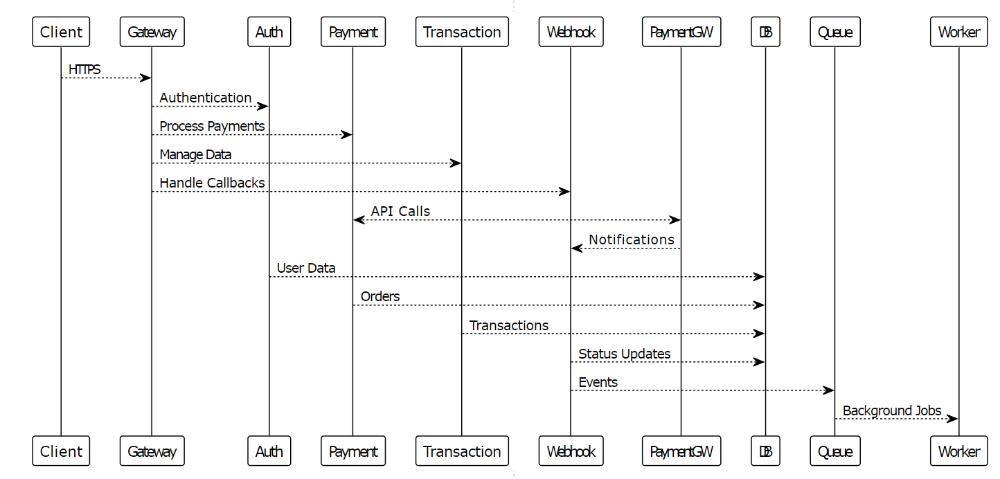

# School Payment System 🎓💳

A microservices-based school payment management system built with modern web technologies. This repository contains both client-side (React) and server-side (NestJS) applications that work together to provide a comprehensive payment solution for educational institutions.

## 🚀 Live Deployment

- **Frontend Application**: [https://school-payment-nine.vercel.app/](https://school-payment-nine.vercel.app/)
- **Backend API**: [https://school-payment-backend-production-2b2a.up.railway.app/](https://school-payment-backend-production-2b2a.up.railway.app/)

## 🏗️ Architecture Overview

This is a microservices architecture with two main services:

```
┌─────────────────┐    HTTP/REST     ┌─────────────────┐
│                 │    API Calls     │                 │
│   Client App    │ ────────────────▶│   Server API    │
│   (React.js)    │                  │   (NestJS)      │
│                 │◀──────────────── │                 │
└─────────────────┘    JSON Data     └─────────────────┘
                                            │
                                            ▼
                                     ┌─────────────────┐
                                     │   MongoDB       │
                                     │   Database      │
                                     └─────────────────┘
```
## 🏗️  Sequence diagram
The following diagram shows the request flow between microservices:



*This sequence diagram illustrates how client requests flow through the API gateway to various microservices and external systems.*

## 📁 Repository Structure

```
school-payment/
├── README.md              # This file - project overview
├── client/                # Frontend React application
│   ├── README.md         # Client-specific documentation
│   ├── src/              # React source code
│   ├── public/           # Static assets
│   ├── package.json      # Client dependencies
│   └── vite.config.js    # Build configuration
├── server/               # Backend NestJS application
│   ├── README.md         # Server-specific documentation
│   ├── src/              # NestJS source code
│   ├── package.json      # Server dependencies
│   └── nest-cli.json     # NestJS configuration
└── docs/                 # Optional: shared documentation
```

## ✨ Key Features

### 🎯 Core Functionality
- **Secure Payment Processing**: Multiple payment gateway integration
- **Real-time Transaction Tracking**: Live status updates via webhooks
- **Advanced Filtering & Search**: Multi-parameter transaction filtering
- **Data Export**: CSV export for reporting and analytics
- **Responsive Design**: Optimized for desktop, tablet, and mobile devices

### 🔒 Security & Authentication
- JWT-based authentication system
- Role-based access control
- Secure password hashing
- Input validation and sanitization

### 📊 Analytics & Reporting
- Transaction statistics and trends
- School-wise payment tracking
- Payment gateway performance metrics
- Export capabilities for external reporting

## 🛠️ Technology Stack

### Frontend (Client)
- **Framework**: React.js 18.2.0
- **Build Tool**: Vite
- **Styling**: Tailwind CSS
- **State Management**: Zustand
- **Routing**: React Router
- **UI Components**: Radix UI + Custom components

### Backend (Server)
- **Framework**: NestJS
- **Database**: MongoDB Atlas
- **Authentication**: JWT
- **Validation**: class-validator
- **HTTP Client**: Axios
- **Password Security**: bcryptjs

### Deployment & DevOps
- **Frontend Hosting**: Vercel
- **Backend Hosting**: Railway
- **Database**: MongoDB Atlas
- **Version Control**: Git/GitHub

## 🚀 Quick Start

### Prerequisites
- Node.js (v16 or higher)
- MongoDB Atlas account or local MongoDB
- npm or yarn package manager

### 1. Clone the Repository
```bash
git clone https://github.com/your-username/school-payment.git
cd school-payment
```

### 2. Setup Client Application
```bash
cd client
npm install
cp .env.example .env.local
# Edit .env.local with your configuration
npm run dev
```
📖 **Detailed Setup**: See [client/README.md](./client/README.md)

### 3. Setup Server Application
```bash
cd server
npm install
cp .env.example .env
# Edit .env with your configuration
npm run start:dev
```
📖 **Detailed Setup**: See [server/README.md](./server/README.md)

### 4. Access Applications
- **Client**: http://localhost:3000
- **Server API**: http://localhost:8000

## 📚 Service Documentation

Each microservice has its own detailed documentation:

- **[Client Documentation](./client/README.md)**: Frontend setup, components, deployment
- **[Server Documentation](./server/README.md)**: API endpoints, database schema, deployment

## 🔗 API Integration

The client communicates with the server via REST API:

```javascript
// Example API call from client
const response = await fetch(`${API_BASE_URL}/transactions`, {
  headers: {
    'Authorization': `Bearer ${token}`,
    'Content-Type': 'application/json'
  }
});
```

### Key API Endpoints
- `POST /auth/login` - User authentication
- `GET /transactions` - Fetch transactions with filtering
- `POST /payment/create-payment` - Create new payment
- `GET /transaction-status/:id` - Check payment status
- `POST /webhook` - Payment gateway webhooks

## 🌐 Deployment

### Production Deployment

**Client (Frontend)**:
- Platform: Vercel
- URL: https://school-payment-nine.vercel.app/
- Auto-deploys from `main` branch

**Server (Backend)**:
- Platform: Railway
- URL: https://school-payment-backend-production-2b2a.up.railway.app/
- Auto-deploys from `main` branch

### Environment Variables

**Client**:
```env
VITE_API_BASE_URL=https://your-server-url.com
VITE_ENVIRONMENT=production
```

**Server**:
```env
MONGODB_URI=mongodb+srv://...
JWT_SECRET=your-secret-key
NODE_ENV=production
```

## 🧪 Development Workflow

### Local Development
```bash
# Terminal 1 - Start server
cd server
npm run start:dev

# Terminal 2 - Start client
cd client
npm run dev
```

### Making Changes
1. Work on client and server independently
2. Test integration between services
3. Update respective README files
4. Follow commit conventions

### Testing
```bash
# Client tests
cd client
npm run test

# Server tests
cd server
npm run test
```

## 🐛 Troubleshooting

### Common Issues

**Connection Issues**:
- Verify API_BASE_URL in client environment
- Check server is running on correct port
- Ensure MongoDB connection is established

**Authentication Issues**:
- Check JWT_SECRET consistency between services
- Verify token expiration settings
- Confirm user credentials

**CORS Issues**:
- Update CORS settings in server for client URL
- Check preflight request handling

### Getting Help
1. Check individual service README files
2. Review console logs in both client and server
3. Verify environment variables are set correctly
4. Check network requests in browser dev tools

## 🤝 Contributing

### Development Setup
1. Fork the repository
2. Create a feature branch
3. Make changes to appropriate service (client/server)
4. Update relevant documentation
5. Test both services work together
6. Submit pull request

### Guidelines
- Keep client and server changes in separate commits when possible
- Update appropriate README files
- Follow existing code patterns
- Add tests for new features
- Ensure both services work independently

## 📈 Future Roadmap

- [ ] **Mobile App**: React Native application
- [ ] **Notification Service**: Email/SMS notifications
- [ ] **Analytics Service**: Advanced reporting microservice
- [ ] **File Storage Service**: Document and receipt management
- [ ] **Admin Dashboard**: Advanced administration features
- [ ] **Multi-tenant Architecture**: Support multiple institutions

## 🛡️ Security Considerations

- All sensitive data is encrypted
- Regular security audits and updates
- HTTPS enforcement in production
- Rate limiting on API endpoints
- Input validation and sanitization

## 📞 Support & Contact

- **Issues**: Create GitHub issues for bugs/features
- **Documentation**: Check service-specific README files
- **API Questions**: See server/README.md
- **UI/UX Questions**: See client/README.md

## 📄 License

This project is licensed under the MIT License - see the [LICENSE](LICENSE) file for details.

---

**🏫 Built for educational institutions worldwide**

*A modern, scalable payment solution for schools and universities*
